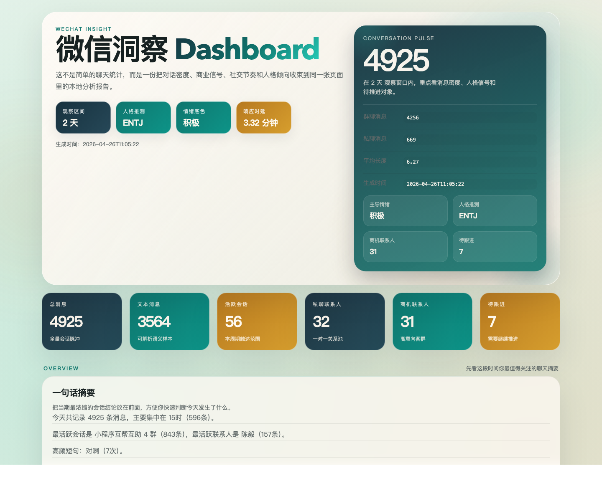
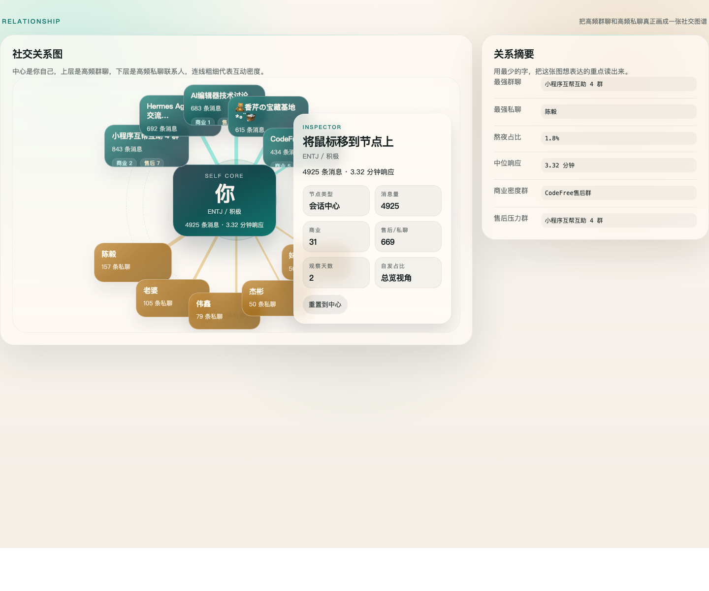

# WeChat Insight

把你的微信聊天记录，变成一个可以本地查看的关系洞察、客户线索和人格画像工作台。

> 一个本地优先的微信分析项目：从聊天记录里看到关系结构、商业机会和表达习惯。

面向 `macOS + 微信 Mac 4.x`，从本地加密数据库提取聊天记录，生成：

- 导出数据和统一特征层
- 日报、客户分析、待跟进信号
- 情绪分析、MBTI 推测、口癖统计、社交图谱
- 本地可打开的静态 HTML 报告
- 本地交互式 React dashboard

## 一句话看懂

`WeChat Insight = 微信聊天记录导出 + 分析引擎 + HTML 报告 + 本地 dashboard`

它不是单纯“把聊天导出来”，而是把聊天变成一套可以看的洞察结果。

## 效果预览

你最终会得到两种展示结果：

- 一份本地可直接打开的静态 HTML 报告，适合归档、截图和分享
- 一个本地交互式 dashboard，适合筛选、查看趋势和关系图

### Dashboard 首页


### HTML 报告首页



### 社交关系图



如果你准备发 GitHub 或做自媒体内容，这三张图已经够你完成首页展示了。

## 为什么这个项目值得看

- **全本地**：默认不上传云端，数据留在自己机器上
- **链路完整**：从密钥提取、消息导出、特征层、分析层到展示层全部打通
- **可直接分享**：可以导出静态 HTML，也可以跑本地 dashboard
- **不止做统计**：除了消息量和活跃时段，还会给出客户机会、待跟进、语言风格和关系画像

## 你最终能看到什么

- 哪些群和联系人最活跃
- 你最近的聊天节奏、昼夜分布、响应时延
- 哪些私聊有商业机会、哪些对话值得跟进
- 你的高频表达、口癖和常见说话风格
- 基于聊天表达风格的 `MBTI` 和情绪启发式画像
- 一份可直接打开的本地网页报告

## 适合谁

- 想分析自己的微信社交结构和聊天节奏
- 想把微信私聊整理成客户线索和待跟进列表
- 想做“个人数据分析 / 数字分身 / 关系画像”类内容分享
- 想把分析结果做成网页、截图或 dashboard 展示

## 当前能力

- `doctor`：检查配置状态
- `setup`：首次提取数据库密钥并生成配置
- `list` / `export`：列出会话并导出 JSONL
- `features`：生成统一特征层
- `daily` / `digest` / `customer` / `labels`：日报、一键自动化日报、客户分析、标签模板
- `emotion` / `mbti` / `speech` / `social`：高级画像分析
- `report-data`：汇总统一展示载荷
- `html`：生成本地可打开的静态网页报告
- `dashboard`：启动本地 React dashboard

## 使用边界

- 目前仅支持 `macOS`
- 需要本机已安装并登录过 `微信 Mac 4.x`
- 默认是本地处理，不上传云端
- 请只处理你自己有权处理的数据
- `MBTI / 情绪 / 口癖 / 社交图谱` 当前属于启发式分析，结果仅供参考

## 环境要求

- Python `3.9+`
- Node.js `18+`，用于 React dashboard，`20+` 更稳

## 快速开始

```bash
git clone <your-repo-url>
cd wechat-insight

python3 -m venv .venv
source .venv/bin/activate
pip install -r requirements.txt
```

先检查环境：

```bash
./wechat-insight doctor
```

首次提取密钥并生成配置：

```bash
./wechat-insight setup
```

说明：

- `setup` 过程中会尝试自动安装 `frida / frida-tools`
- 过程中需要你手动登录微信
- 默认配置会写到：
  - `~/.config/wechat-insight.json`
  - `~/.config/wechat-keys.json`

导出最近 7 天聊天：

```bash
./wechat-insight export --days 7
```

生成日报和客户分析：

```bash
./wechat-insight daily --input ~/.wechat-insight/data/messages_*.jsonl
./wechat-insight customer --input ~/.wechat-insight/data/messages_*.jsonl
```

给 OpenClaw / 其他自动化宿主生成当天沟通摘要：

```bash
./wechat-insight digest --today --stdout
```

说明：

- `digest` 会先导出当天消息，再生成 Markdown 日报
- 输出固定包含 `DIGEST_REPORT_PATH=...`，自动化宿主可以读取该文件再推送
- `--stdout` 会同时把 Markdown 正文打印出来，方便直接作为推送内容
- 首次初始化仍需人工执行 `./wechat-insight setup`

生成静态网页报告：

```bash
./wechat-insight html --input ~/.wechat-insight/data/messages_*.jsonl
```

启动本地 dashboard：

```bash
./wechat-insight dashboard --input ~/.wechat-insight/data/messages_*.jsonl
```

如果你想手动准备前端依赖：

```bash
cd dashboard
npm install
```

## 常用命令

```bash
./wechat-insight doctor
./wechat-insight setup
./wechat-insight list
./wechat-insight export --days 30
./wechat-insight digest --today --stdout
./wechat-insight features --input ~/.wechat-insight/data/messages_*.jsonl
./wechat-insight daily --input ~/.wechat-insight/data/messages_*.jsonl
./wechat-insight customer --input ~/.wechat-insight/data/messages_*.jsonl
./wechat-insight labels --input ~/.wechat-insight/data/messages_*.jsonl
./wechat-insight emotion --input ~/.wechat-insight/data/messages_*.jsonl
./wechat-insight mbti --input ~/.wechat-insight/data/messages_*.jsonl
./wechat-insight speech --input ~/.wechat-insight/data/messages_*.jsonl
./wechat-insight social --input ~/.wechat-insight/data/messages_*.jsonl
./wechat-insight report-data --input ~/.wechat-insight/data/messages_*.jsonl
./wechat-insight html --input ~/.wechat-insight/data/messages_*.jsonl
./wechat-insight dashboard --input ~/.wechat-insight/data/messages_*.jsonl
```

## 输出位置

默认会写到：

- 数据导出：`~/.wechat-insight/data/`
- 特征层：`~/.wechat-insight/features/`
- 报告：`~/.wechat-insight/reports/`

常见产物：

- `messages_*.jsonl`
- `features_*.jsonl`
- `daily_*.md`
- `customer_*.md`
- `emotion_*.md`
- `mbti_*.md`
- `speech_*.md`
- `social_*.md`
- `report_payload_*.json`
- `dashboard_*.html`

## OpenClaw 自动化建议

OpenClaw 负责定时、推送和失败重试；本项目只提供稳定的本地日报生成命令。

推荐任务命令：

```bash
cd /path/to/wechat-insight
./wechat-insight doctor
./wechat-insight digest --today --stdout
```

自动化策略：

- `doctor` 返回非 0 时，提示用户先人工执行 `setup`
- `digest` 返回 0 时，读取 stdout 或 `DIGEST_REPORT_PATH` 对应文件
- 当天没有消息时，`digest` 仍会生成“暂无可分析消息”的日报，避免误报任务失败
- 不要在定时任务里执行 `setup`，因为它需要登录微信和 Frida 注入

## 开发

运行 Python 测试：

```bash
python3 -m unittest discover -s tests -p 'test_*.py'
```

构建 dashboard：

```bash
cd dashboard
npm ci
npm run build
```

## 本机验收

这个项目以真机链路为准，默认不依赖 GitHub CI。

常用本机回归：

```bash
./scripts/local_smoke.sh doctor
./scripts/local_smoke.sh setup
./scripts/local_smoke.sh quick --days 7
```

## 项目结构

```text
wechat-insight/
├── scripts/
│   ├── extract_keys.py
│   ├── export_messages.py
│   ├── features/
│   └── analyze/
├── dashboard/
├── docs/
├── tests/
├── wechat-insight
└── wechat_insight_cli.py
```

## 说明

- dashboard 中部分动效组件参考并改造自 React Bits
- 当前仓库默认不包含真实聊天数据与真实分析产物

## License

MIT，见 [LICENSE](./LICENSE)
