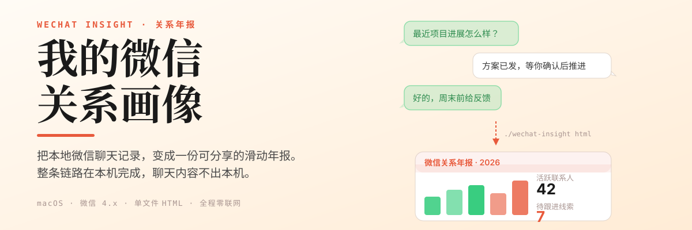
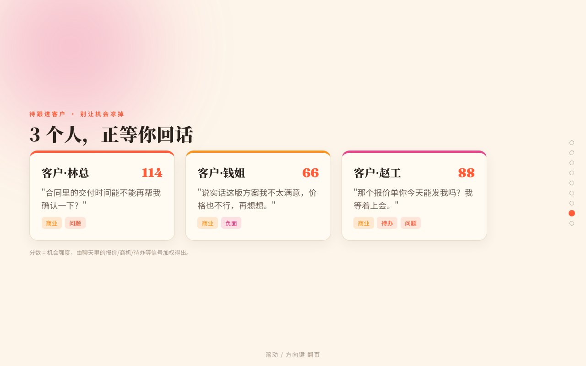
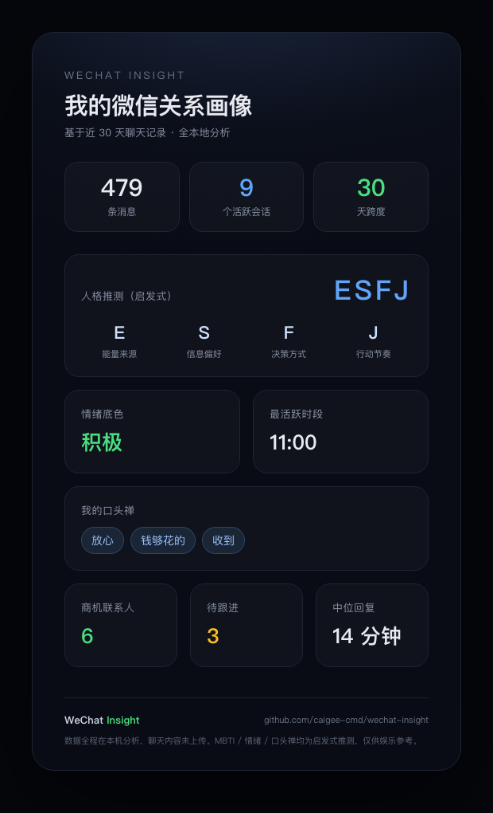

# WeChat Insight



把本地微信聊天记录，变成一份关于关系、商机、情绪与表达习惯的**滑动年报**。整条链路在本机完成，聊天内容不出本机。


面向 `macOS + 微信 Mac 4.x`，从本地加密数据库提取聊天记录，生成日报、客户分析、人格画像，最终输出一份双击即开的**单文件 HTML 滑动年报**。

**不想安装？[在线看一份示例报告](https://caigee-cmd.github.io/wechat-insight/)**（脱敏假数据，无需安装、无需联网）。

---

<p>
  
  
</p>

一份**叙事版滑动年报**（单文件 HTML，双击即开、可分享），整屏翻页一眼看完：

- 哪些群和联系人最活跃，聊天节奏、昼夜分布、响应时延
- 哪些私聊有商业机会、哪些对话值得跟进
- 高频表达、口癖、说话风格，以及 MBTI / 情绪画像（均为启发式，仅供参考）

---


读微信记录很敏感，所以第一原则是：**你的聊天内容永远不出本机。**

- **分析全程零联网**：导出、特征、分析、出报告整条链路不访问网络，由 [`tests/test_no_network.py`](./tests/test_no_network.py) 自动断言守护。
- **唯一的联网**：只在装依赖（`pip`）和 `setup` 注入 Frida 时发生，都不接触你的聊天内容。
- **开源可审计**：数据产物默认只写到本机 `~/.wechat-insight/`。

> 想自己验证"零联网"？拔网线跑 `python3 -m unittest discover -s tests -p 'test_*.py'`。

---


### 安装

一行安装（macOS only，clone 到 `~/.local/share/wechat-insight` 并装好 venv 和依赖）：

```bash
curl -sL https://raw.githubusercontent.com/caigee-cmd/wechat-insight/main/install.sh | bash
```

或手动安装：

```bash
git clone https://github.com/caigee-cmd/wechat-insight.git
cd wechat-insight
python3 -m venv .venv
.venv/bin/pip install -r requirements.txt
```

> `./wechat-insight` launcher 会自动使用项目自带的 `.venv`，无需每次 `source activate`。需要 Python `3.9+`（年报是纯 Python 渲染，不依赖 Node）。

### 四步出报告

1. **检查环境**：`./wechat-insight doctor`
2. **首次设置**（提取密钥、生成配置，需手动登录微信）：`./wechat-insight setup`
3. **导出聊天记录**（默认最近 7 天）：`./wechat-insight export --days 7`
4. **生成报告**：

   ```bash
   ./wechat-insight daily   # 日报
   ./wechat-insight html    # 滑动年报 HTML
   ./wechat-insight share   # 可分享的关系画像卡
   ```

`setup` 会自动安装 `frida / frida-tools`，并把配置写到 `~/.config/wechat-insight.json` 和 `~/.config/wechat-keys.json`。

> 大多数命令支持 `--input ~/.wechat-insight/data/messages_*.jsonl` 指定输入；`html` 默认出滑动年报，加 `--renderer legacy` 出旧版静态模板。

### 作为 Claude Code 插件（可选）

本仓库本身就是一个 [Claude Code](https://claude.com/claude-code) 插件市场，在 Claude Code 里执行：

```
/plugin marketplace add caigee-cmd/wechat-insight
/plugin install wechat-insight@wechat-insight
```

装好后直接说"分析我的微信聊天记录""看看最近的客户线索""生成一份微信滑动年报"，就会触发 `analyzing-wechat-chats` skill，由它编排导出、分析和出报告。

> 插件只含编排用的 skill，不含 CLI 本体；skill 运行时仍需要 `./wechat-insight` CLI，本机没装会引导你跑安装脚本。

---


仓库内置脱敏样例数据 [`docs/sample/messages_sample.jsonl`](docs/sample/messages_sample.jsonl)，可直接喂给任意命令：

```bash
./wechat-insight html --input docs/sample/messages_sample.jsonl
./wechat-insight share --input docs/sample/messages_sample.jsonl
```

`share` 生成的关系画像卡（适合发朋友圈 / 群聊）：

<p>
  
</p>

---

## 命令一览

| 命令 | 作用 |
|------|------|
| `doctor` / `setup` | 检查配置 / 首次提取密钥并生成配置 |
| `list` / `export` | 列出会话 / 导出 JSONL |
| `features` | 生成统一特征层 |
| `daily` / `digest` | 日报 / 一键自动化日报 |
| `customer` / `labels` | 客户分析 / 联系人标签模板 |
| `unreplied` | 列出最后一条是对方发来、你还没回的会话（支持 `--days` / `--exclude-ad`） |
| `emotion` / `mbti` / `speech` / `social` | 情绪、MBTI、口癖、社交图谱（启发式，仅供参考） |
| `report-data` / `html` / `share` | 统一展示载荷 / 滑动年报 / 关系画像卡 |

## 输出位置

默认写到 `~/.wechat-insight/`：

- 数据导出：`data/messages_*.jsonl`
- 特征层：`features/*.jsonl`
- 报告：`reports/`（`daily_*.md`、`customer_*.md`、`report_payload_*.json`、`dashboard_*.html` 等）

### OpenClaw 自动化

OpenClaw 负责定时、推送和失败重试，定时任务只调用以下命令（`setup` 需手动执行，不要放进定时任务）：

```bash
./wechat-insight doctor                   # 非 0 说明需要先手动 setup
./wechat-insight digest --today --stdout  # 返回 0，读取 stdout 或 DIGEST_REPORT_PATH；当天无消息也返回 0
```

---


内核是"本地分析引擎 + 单文件报告"，后续会接入更多数据源和画像维度（朋友圈、收藏、企业微信 / 飞书报告、Windows 微信支持、可选本地模型增强），始终坚持"分析全程零联网、内容不出本机"。欢迎 issue / PR。

---


- 仅支持 macOS，需已安装并登录过微信 Mac 4.x
- 请只处理你自己有权处理的数据
- MBTI / 情绪 / 口癖 / 社交图谱属于启发式分析（基于聊天文本的统计规则推测，不是医学诊断、心理测评或模型级结论），仅供参考

---

## 开发

```bash
python3 -m unittest discover -s tests -p 'test_*.py'   # Python 测试
./scripts/local_smoke.sh quick --days 7                # 本机回归
```

## License

MIT，见 [LICENSE](./LICENSE)
