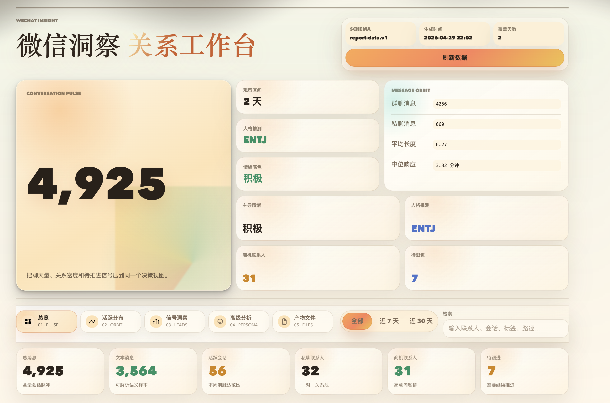
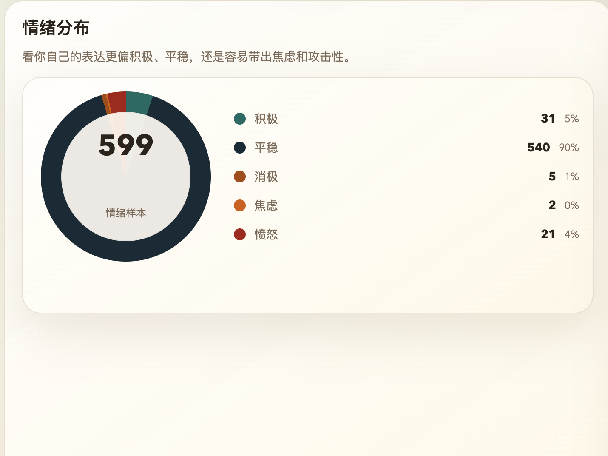
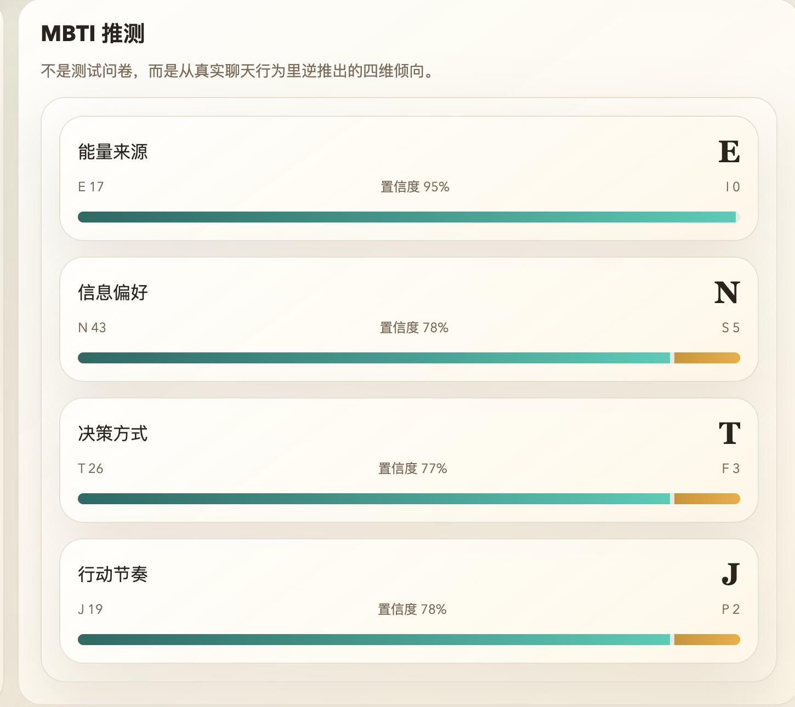
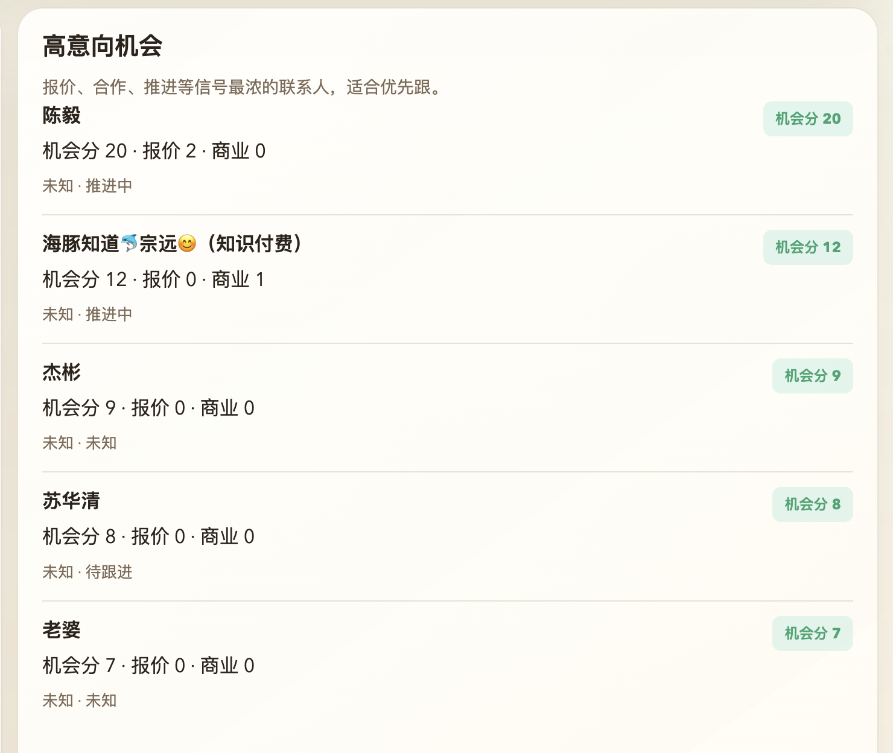

# WeChat Insight

把你的微信聊天记录，变成一个可以本地查看的关系洞察、客户线索和人格画像工作台。


> 一个本地优先的微信分析项目：从聊天记录里看到关系结构、商业机会和表达习惯。

**不想安装？[在线看一份示例报告](https://caigee-cmd.github.io/wechat-insight/)（脱敏假数据，无需安装、无需联网）。**

## 隐私优先（这是这个项目的底线）

读你的微信记录是件很敏感的事，所以这个项目的第一原则是：**你的聊天内容永远不出本机。**

- **分析全程零联网**：导出、特征、分析、出报告，整条链路不访问网络。代码里没有任何 `requests` / `urllib` / `socket` 等出网调用，由 [`tests/test_no_network.py`](./tests/test_no_network.py) 自动断言守护——任何人引入联网依赖，测试都会立刻失败。
- **可断网实测**：拔掉网线 / 关掉 WiFi 一样能跑完整条分析链路，欢迎自己验证。
- **唯一的联网**：只发生在装依赖（`pip` / `npm` 拉公共依赖包）和 `setup` 阶段注入 Frida 时，这些都不接触、更不上传你的聊天内容。
- **开源可审计**：全部逻辑在本仓库，数据产物默认只写到你本机的 `~/.wechat-insight/`。

> 想自己验证"零联网"？跑 `python3 -m unittest discover -s tests -p 'test_*.py'`，其中 `test_no_network` 会扫描整条分析链路。

面向 `macOS + 微信 Mac 4.x`，从本地加密数据库提取聊天记录，生成：

- 导出数据和统一特征层
- 日报、客户分析、待跟进信号
- 情绪分析、MBTI 推测、口癖统计、社交图谱（均为启发式分析，仅供参考）
- 本地可打开的单文件 HTML 报告：默认是一份整屏翻页的"叙事版滑动年报"，也可切换成交互式 React 工作台

## 一句话看懂

`WeChat Insight = 微信聊天记录导出 + 分析引擎 + 单文件 HTML 报告（内置交互式工作台）`

它不是单纯“把聊天导出来”，而是把聊天变成一套可以看的洞察结果。

## 效果预览

你最终会得到一份**单文件 HTML 报告**：双击就能开、可以发邮件/微信。默认是一份**叙事版滑动年报**——整屏翻页，从概览、人格、情绪到待跟进一眼看完，适合分享；也可以用 `--renderer react` 导出可筛选切换的交互式工作台。

截图文件统一放在 `docs/screenshots/`，README 里展示的是几个最核心的页面状态。

### 关系工作台总览



展示报告的主工作台视图：总消息量、覆盖天数、消息结构、人格推测、情绪底色和待跟进数量会被压到同一个决策界面里，适合快速判断这段时间的整体聊天状态。

### 情绪分布（启发式）



展示高级分析里的情绪结构。属于启发式分析（基于聊天文本的统计规则推测，不是医学诊断、心理测评或模型级结论），结果仅供参考。用来观察表达更偏积极、平稳，还是更容易出现焦虑、愤怒和消极信号。

### MBTI 推测（启发式）



展示基于聊天行为反推的四维倾向，包括能量来源、信息偏好、决策方式和行动节奏。属于启发式分析（基于表达风格统计推测，不是正式人格测评），结果仅供参考。

### 待跟进客户



展示客户维度聚合出的待处理项。它会把私聊里的问题、排期、负面反馈和疑似商机集中到一个列表里，方便优先处理最值得继续跟进的人和事。


## 为什么这个项目值得看

- **全本地**：默认不上传云端，数据留在自己机器上
- **链路完整**：从密钥提取、消息导出、特征层、分析层到展示层全部打通
- **可直接分享**：导出单文件 HTML，里面内联了完整的交互式工作台
- **不止做统计**：除了消息量和活跃时段，还会给出客户机会、待跟进、语言风格和关系画像

## 你最终能看到什么

- 哪些群和联系人最活跃
- 你最近的聊天节奏、昼夜分布、响应时延
- 哪些私聊有商业机会、哪些对话值得跟进
- 你的高频表达、口癖和常见说话风格（启发式）
- 基于聊天表达风格的 `MBTI` 和情绪画像（启发式，仅供参考）
- 一份可直接打开的本地网页报告

## 适合谁

- 想分析自己的微信社交结构和聊天节奏
- 想把微信私聊整理成客户线索和待跟进列表
- 想做“个人数据分析 / 数字分身 / 关系画像”类内容分享
- 想把分析结果做成网页、截图展示

## 当前能力

- `doctor`：检查配置状态
- `setup`：首次提取数据库密钥并生成配置
- `list` / `export`：列出会话并导出 JSONL
- `features`：生成统一特征层
- `daily` / `digest` / `customer` / `labels`：日报、一键自动化日报、客户分析、标签模板
- `emotion` / `mbti` / `speech` / `social`：高级画像分析（启发式，仅供参考）
- `report-data`：汇总统一展示载荷
- `html`：生成本地可打开的单文件 HTML 报告（默认叙事版滑动年报；`--renderer react` 出交互式工作台，`--renderer legacy` 出旧版静态模板）
- `share`：生成一张可分享的竖版"关系画像卡"（适配朋友圈/小红书，截图即用）

## Roadmap

这个项目的内核是“一套本地分析引擎 + 单文件报告”，后续主要是**接入更多数据源、扩展更多画像维度**，所有新增能力都会延续“分析全程零联网、内容不出本机”这条底线。

已上线：

- 微信 Mac 4.x 聊天记录的导出、特征层、客户/情绪/MBTI/口癖/社交分析与单文件 HTML 报告
- 可分享的关系画像卡、脱敏在线 Demo

计划中（欢迎 issue / PR 一起讨论优先级）：

- **朋友圈分析**：从朋友圈动态里看发布节奏、互动关系和话题偏好
- **收藏分析**：把收藏内容整理成主题/兴趣图谱，看长期关注什么
- **企业微信 / 飞书报告**：把同一套分析能力接到企业微信、飞书，生成团队沟通与客户跟进视角的报告
- **更多平台**：Windows 端微信支持
- **可选的本地增强**：在保持零联网的前提下，接本地模型做更细的画像总结

> 标注“计划中”表示方向已确定但尚未实现，具体顺序会根据反馈调整。

## 使用边界

- 目前仅支持 `macOS`
- 需要本机已安装并登录过 `微信 Mac 4.x`
- 默认是本地处理，不上传云端
- 请只处理你自己有权处理的数据
- `MBTI / 情绪 / 口癖 / 社交图谱` 属于启发式分析（基于聊天文本的统计规则推测，不是医学诊断、心理测评或模型级结论），结果仅供参考

## 环境要求

- Python `3.9+`
- Node.js `18+`（`20+` 更稳）：仅在用 `--renderer react` 导出 React 工作台时才需要；默认的滑动年报是纯 Python 渲染，不依赖 Node

## 快速开始

**一行安装**（macOS only，会 clone 到 `~/.local/share/wechat-insight` 并装好 venv 和依赖）：

```bash
curl -sL https://raw.githubusercontent.com/caigee-cmd/wechat-insight/main/install.sh | bash
```

或手动安装：

```bash
git clone https://github.com/caigee-cmd/wechat-insight.git
cd wechat-insight

python3 -m venv .venv
.venv/bin/pip install -r requirements.txt
```

`./wechat-insight` launcher 会自动使用项目自带的 `.venv`，不需要每次 `source activate`。

先检查环境：

```bash
./wechat-insight doctor
```

首次提取密钥并生成配置：

```bash
./wechat-insight setup
```

说明：

- `setup` 过程中会尝试自动安装 `frida / frida-tools`
- 过程中需要你手动登录微信
- 默认配置会写到：
  - `~/.config/wechat-insight.json`
  - `~/.config/wechat-keys.json`

导出最近 7 天聊天：

```bash
./wechat-insight export --days 7
```

生成日报和客户分析：

```bash
./wechat-insight daily --input ~/.wechat-insight/data/messages_*.jsonl
./wechat-insight customer --input ~/.wechat-insight/data/messages_*.jsonl
```

给 OpenClaw / 其他自动化宿主生成当天沟通摘要：

```bash
./wechat-insight digest --today --stdout
```

说明：

- `digest` 会先导出当天消息，再生成 Markdown 日报
- 输出固定包含 `DIGEST_REPORT_PATH=...`，自动化宿主可以读取该文件再推送
- `--stdout` 会同时把 Markdown 正文打印出来，方便直接作为推送内容
- 首次初始化仍需人工执行 `./wechat-insight setup`

生成静态网页报告：

```bash
./wechat-insight html --input ~/.wechat-insight/data/messages_*.jsonl
```

默认（`--renderer slides`）用纯 Python 渲染一份叙事版滑动年报，不需要 Node；想要交互式 React 工作台加 `--renderer react`，想要旧版 Python 静态模板加 `--renderer legacy`。

生成一张可分享的"关系画像卡"（竖版单文件 HTML，浏览器打开后截图即可发朋友圈/小红书）：

```bash
./wechat-insight share --input ~/.wechat-insight/data/messages_*.jsonl
```

分享卡只挑最有"晒点"的几个结果（消息量、MBTI、情绪底色、口头禅、待跟进数），底部带项目水印，是纯本地、零联网生成的。

用 `--renderer react` 时，`html` 命令首次运行会自动跑 `npm install`。如果想提前装好前端依赖加快首次出图：

```bash
cd dashboard
npm install
```

## 常用命令

```bash
./wechat-insight doctor
./wechat-insight setup
./wechat-insight list
./wechat-insight export --days 30
./wechat-insight digest --today --stdout
./wechat-insight features --input ~/.wechat-insight/data/messages_*.jsonl
./wechat-insight daily --input ~/.wechat-insight/data/messages_*.jsonl
./wechat-insight customer --input ~/.wechat-insight/data/messages_*.jsonl
./wechat-insight labels --input ~/.wechat-insight/data/messages_*.jsonl
./wechat-insight emotion --input ~/.wechat-insight/data/messages_*.jsonl
./wechat-insight mbti --input ~/.wechat-insight/data/messages_*.jsonl
./wechat-insight speech --input ~/.wechat-insight/data/messages_*.jsonl
./wechat-insight social --input ~/.wechat-insight/data/messages_*.jsonl
./wechat-insight report-data --input ~/.wechat-insight/data/messages_*.jsonl
./wechat-insight html --input ~/.wechat-insight/data/messages_*.jsonl
./wechat-insight share --input ~/.wechat-insight/data/messages_*.jsonl
```

## 在线 Demo 与脱敏样例

不想安装、想先看效果？

- **在线示例报告**：<https://caigee-cmd.github.io/wechat-insight/>（由脱敏虚构数据生成，无真实聊天内容）
- **脱敏样例数据**：仓库内置 [`docs/sample/messages_sample.jsonl`](docs/sample/messages_sample.jsonl)，用固定随机种子生成的虚构对话，可直接喂给任意命令试跑：

```bash
# 用样例数据本地出一份完整报告（无需配置微信）
./wechat-insight html --input docs/sample/messages_sample.jsonl
# 或出一张分享卡
./wechat-insight share --input docs/sample/messages_sample.jsonl
```

重建样例与在线 Demo（维护者用）：

```bash
./scripts/build_demo.sh        # 重新生成 docs/sample 与 docs/demo
python3 scripts/make_sample_data.py --days 30 --seed 42   # 只重生成样例数据
```

> 在线 Demo 走 GitHub Pages：仓库 Settings → Pages → Source 选 `Deploy from a branch`、分支 `main`、目录 `/docs` 即可。落地页是 `docs/index.html`，报告在 `docs/demo/index.html`。

## 输出位置

默认会写到：

- 数据导出：`~/.wechat-insight/data/`
- 特征层：`~/.wechat-insight/features/`
- 报告：`~/.wechat-insight/reports/`

常见产物：

- `messages_*.jsonl`
- `features_*.jsonl`
- `daily_*.md`
- `customer_*.md`
- `emotion_*.md`
- `mbti_*.md`
- `speech_*.md`
- `social_*.md`
- `report_payload_*.json`
- `dashboard_*.html`

## OpenClaw 自动化建议

OpenClaw 负责定时、推送和失败重试；本项目只提供稳定的本地日报生成命令。

推荐任务命令：

```bash
cd /path/to/wechat-insight
./wechat-insight doctor
./wechat-insight digest --today --stdout
```

自动化策略：

- `doctor` 返回非 0 时，提示用户先人工执行 `setup`
- `digest` 返回 0 时，读取 stdout 或 `DIGEST_REPORT_PATH` 对应文件
- 当天没有消息时，`digest` 仍会生成“暂无可分析消息”的日报，避免误报任务失败
- 不要在定时任务里执行 `setup`，因为它需要登录微信和 Frida 注入

## 开发

运行 Python 测试：

```bash
python3 -m unittest discover -s tests -p 'test_*.py'
```

构建 React 工作台（开发用，`html` 命令会自动跑）：

```bash
cd dashboard
npm ci
npm run build
```

## 本机验收

这个项目以真机链路为准，默认不依赖 GitHub CI。

常用本机回归：

```bash
./scripts/local_smoke.sh doctor
./scripts/local_smoke.sh setup
./scripts/local_smoke.sh quick --days 7
```

## 项目结构

```text
wechat-insight/
├── scripts/
│   ├── extract_keys.py
│   ├── export_messages.py
│   ├── make_sample_data.py   # 生成脱敏样例数据
│   ├── build_demo.sh         # 一键重建在线 Demo
│   ├── features/
│   └── analyze/              # 含 share_card.py 等分析器
├── dashboard/
├── docs/
│   ├── index.html            # GitHub Pages 落地页
│   ├── demo/                 # 在线示例报告 + 分享卡
│   └── sample/               # 脱敏样例数据
├── tests/
├── wechat-insight
└── wechat_insight_cli.py
```

## 说明

- HTML 报告内嵌的 React 工作台中，部分动效组件参考并改造自 React Bits
- 当前仓库默认不包含真实聊天数据与真实分析产物

## License

MIT，见 [LICENSE](./LICENSE)
